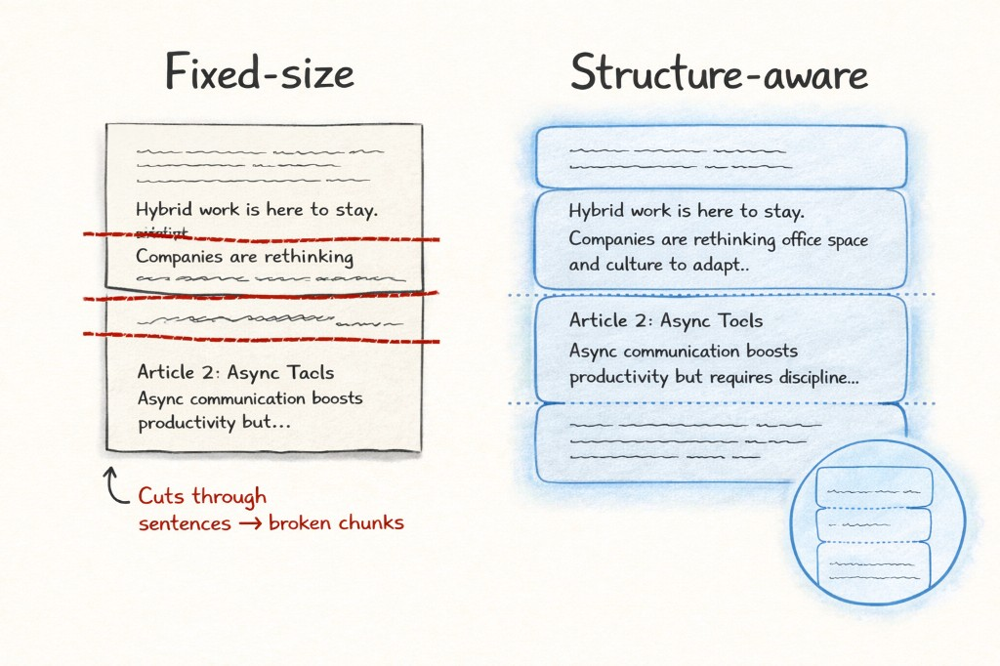

# chunkweaver

**The structure-aware chunking layer between your extractor and your vector DB.**

[](https://pypi.org/project/chunkweaver/)
[](https://opensource.org/licenses/MIT)
[](https://www.python.org/downloads/)

---

## Where chunkweaver fits

```
  PDF / DOCX / HTML              Your vector DB
        │                              ▲
        ▼                              │
  ┌───────────┐    ┌──────────────┐    │
  │ Extractor │───▶│ chunkweaver  │────┘
  │           │    │              │
  │ unstructured   │ boundaries   │  Embed + upsert
  │ marker-pdf     │ detectors    │  into Pinecone,
  │ docling        │ presets      │  Qdrant, Weaviate,
  │ pdfminer       │ overlap      │  ChromaDB, etc.
  └───────────┘    └──────────────┘
```

Your extractor turns files into text. Your vector DB stores embeddings.
chunkweaver sits in the middle — splitting that text at structural
boundaries so each chunk is a coherent unit of meaning, not an arbitrary
slice of characters.

## The problem

Standard chunkers — including LangChain's `RecursiveCharacterTextSplitter` —
are paragraph-aware but not structure-aware. They don't know that
"Article 17" starts a new legal section, or that a financial table's
header row belongs with its data. The result: chunks that split
mid-section, producing blurry embeddings and incomplete retrievals.

<p align="center">
  
</p>

Our [LLM-as-judge benchmark](benchmark/README.md) on 11 structured documents
(GDPR, EU AI Act, CCPA, 8 IETF RFCs) and 58 queries shows:

| Baseline | CW wins | Baseline wins | p-value |
|----------|---------|---------------|---------|
| Naive 600-char | **15** | 4 | **0.019** |
| LangChain RCTS | **11** | 4 | 0.119 |

chunkweaver significantly outperforms naive chunking (p < 0.02). Against
LangChain RCTS, the win ratio is similar (11:4) but not significant at
this sample size — RCTS's paragraph heuristic captures some structural
signal, narrowing the gap. The advantage is clearest on documents with
explicit section markers. See [benchmark/](benchmark/) for full results,
methodology, and reproduction steps.

## What chunkweaver does

Two layers of structure-aware splitting:

1. **Regex boundaries** — you tell the chunker where sections start (`^Article \d+`, `^## `, `^Item 1.`)
2. **Heuristic detectors** — the chunker discovers structure itself (headings by casing/whitespace, tables by numeric patterns)

Both layers work together. Detectors can emit **split points** ("start a new chunk here") or **keep-together regions** ("don't split this table"). When they conflict, keep-together wins.

- **Zero dependencies** — stdlib only, no LangChain/LlamaIndex tax
- **User-defined boundaries** — regex patterns, not hard-coded heuristics
- **Heuristic detectors** — `HeadingDetector`, `TableDetector` for semi-structured documents
- **Semantic overlap** — sentences, not characters
- **Full metadata** — offsets, boundary types, overlap tracking
- **Integrations** — LangChain and LlamaIndex drop-ins; Unstructured planned

## Install

```bash
pip install chunkweaver
```

Extras:

```bash
pip install chunkweaver[cli]        # CLI with click
pip install chunkweaver[langchain]   # LangChain TextSplitter integration
pip install chunkweaver[llamaindex]  # LlamaIndex NodeParser integration
pip install chunkweaver[dev]         # pytest + coverage
```

## Quick start

```python
from chunkweaver import Chunker

# Minimal — just better defaults
chunker = Chunker(target_size=1024)
chunks = chunker.chunk(text)

# Full configuration
chunker = Chunker(
    target_size=1024,
    overlap=2,
    overlap_unit="sentence",
    boundaries=[
        r"^Article\s+\d+",   # GDPR articles
        r"^#{1,3}\s",        # Markdown headers
        r"^\d+\.\d+\s",      # Numbered sections (RFC)
        r"^TABLE\s+",        # Table headers
    ],
    fallback="paragraph",
    min_size=200,
)

# List of strings
chunks = chunker.chunk(text)

# With metadata
chunks = chunker.chunk_with_metadata(text)
for c in chunks:
    print(c.text)            # full chunk content
    print(c.start, c.end)    # character offsets in original
    print(c.boundary_type)   # "section" | "paragraph" | "sentence" | "word"
    print(c.overlap_text)    # the overlap prefix (if any)
    print(c.content_text)    # text without overlap (for dedup)
```

## Vector DB integration

chunkweaver is designed for vector database ingest pipelines:

```python
from chunkweaver import Chunker
from chunkweaver.presets import LEGAL_EU

chunker = Chunker(
    target_size=1024,
    overlap=2,
    overlap_unit="sentence",
    boundaries=LEGAL_EU,
)

chunks = chunker.chunk_with_metadata(document_text)

# Prepare records for your vector DB
records = [
    {
        "id": f"doc-{doc_id}-chunk-{c.index}",
        "text": c.text,
        "metadata": {
            "source": filename,
            "start": c.start,
            "end": c.end,
            "boundary_type": c.boundary_type,
            "has_overlap": bool(c.overlap_text),
        },
    }
    for c in chunks
]

# Embed and upsert into Pinecone / Qdrant / Weaviate / ChromaDB / etc.
```

## Presets

Built-in boundary patterns for common document types:

```python
from chunkweaver.presets import (
    LEGAL_EU, LEGAL_US, RFC, MARKDOWN,
    CHAT, CLINICAL, FINANCIAL, FINANCIAL_TABLE, PLAIN,
)
```

| Preset | Domain | Detects |
|--------|--------|---------|
| `LEGAL_EU` | EU legislation | `Article N`, `CHAPTER`, `SECTION`, `(1)` recitals |
| `LEGAL_US` | US law / contracts | `§ N`, `Section N`, `WHEREAS`, `1.1` clauses |
| `RFC` | IETF RFCs | `1. Intro`, `3.1 Overview`, `Appendix A` |
| `MARKDOWN` | Markdown | `# headings`, `---` rules |
| `CHAT` | Chat logs | `[14:30]`, ISO timestamps, `speaker:` turns |
| `CLINICAL` | Medical notes | `HPI:`, `ASSESSMENT:`, `PLAN:`, etc. |
| `FINANCIAL` | SEC filings | `Item 1.`, `PART I`, `NOTE 1`, `Schedule A` |
| `FINANCIAL_TABLE` | Data tables | `TABLE N`, markdown/ASCII separators |
| `PLAIN` | Any | No boundaries — pure paragraph/sentence fallback |

Combine presets freely:

```python
boundaries = LEGAL_EU + [r"^TABLE\s+", r"^Annex\s+"]
boundaries = FINANCIAL + FINANCIAL_TABLE
```

## LangChain integration

Drop-in replacement for `RecursiveCharacterTextSplitter`:

```python
from chunkweaver.integrations.langchain import ChunkWeaverSplitter

splitter = ChunkWeaverSplitter(
    target_size=1024,
    overlap=2,
    boundaries=[r"^#{1,3}\s"],
)

# Works with LangChain document loaders
docs = splitter.create_documents([text])
```

Requires: `pip install chunkweaver[langchain]`

## LlamaIndex integration

Drop-in `NodeParser` for LlamaIndex ingestion pipelines:

```python
from chunkweaver.integrations.llamaindex import ChunkWeaverNodeParser
from chunkweaver.presets import LEGAL_EU

parser = ChunkWeaverNodeParser(
    target_size=1024,
    boundaries=LEGAL_EU,
    overlap=2,
)

# Works with LlamaIndex document loaders and ingestion pipelines
nodes = parser.get_nodes_from_documents(documents)
```

Supports all chunkweaver features including detectors:

```python
from chunkweaver.detector_heading import HeadingDetector

parser = ChunkWeaverNodeParser(
    target_size=1024,
    detectors=[HeadingDetector()],
)
```

Requires: `pip install chunkweaver[llamaindex]`

## CLI

```bash
# Basic usage
chunkweaver document.txt --size 1024 --overlap 2

# With boundary patterns
chunkweaver file.txt --boundaries "^Article\s+\d+" "^CHAPTER\s+"

# Use a preset
chunkweaver legal_doc.txt --preset legal-eu --format json

# JSONL output (one chunk per line, pipe-friendly)
chunkweaver file.txt --preset markdown --format jsonl

# Preview boundary detection (tune your patterns)
chunkweaver file.txt --detect-boundaries --boundaries "^Article\s+\d+"

# Pipe from stdin
cat document.txt | chunkweaver --size 1024 --preset rfc
```

## Customization cookbook

chunkweaver is designed to be adapted to any text type. Here are recipes
for common scenarios.

### Chat logs & customer support transcripts

Chat text is informal — no uppercase after periods, no paragraph structure.
The default sentence regex (`[.!?]\s+(?=[A-Z"(])`) won't split it well.
Use the `CHAT` preset for turn-level boundaries and `SENTENCE_END_PERMISSIVE`
for overlap that works with lowercase text:

```python
from chunkweaver import Chunker, SENTENCE_END_PERMISSIVE
from chunkweaver.presets import CHAT

chunker = Chunker(
    target_size=512,
    overlap=1,
    overlap_unit="sentence",
    boundaries=CHAT,
    sentence_pattern=SENTENCE_END_PERMISSIVE,
    min_size=0,
)

chat_log = """[14:30] Agent: Welcome to support. How can I help?
[14:31] Customer: My order hasn't arrived. It's been 10 days.
[14:32] Agent: I'm sorry to hear that. Let me look into it.
[14:33] Customer: The order number is 12345.
[14:34] Agent: I see it was shipped Jan 5. It appears to be delayed."""

chunks = chunker.chunk(chat_log)
# Each speaker turn becomes its own chunk
```

### Chinese / Japanese / Korean text

CJK languages use different sentence-ending punctuation (。！？).
The default regex won't detect these:

```python
from chunkweaver import Chunker, SENTENCE_END_CJK

chunker = Chunker(
    target_size=512,
    overlap=1,
    overlap_unit="sentence",
    sentence_pattern=SENTENCE_END_CJK,
)

text = "第一条规定了保护范围。第二条界定了适用条件。第三条明确了领土管辖权。"
chunks = chunker.chunk(text)
```

For mixed-language documents, use a combined pattern:

```python
import re

chunker = Chunker(
    target_size=512,
    overlap=1,
    sentence_pattern=re.compile(r'([.!?。！？])(\s*)'),
)
```

### Healthcare / clinical notes

Discharge summaries and clinical notes have predictable section headers.
The `CLINICAL` preset recognizes `CHIEF COMPLAINT:`, `HPI:`, `ASSESSMENT:`,
`PLAN:`, and many more:

```python
from chunkweaver import Chunker
from chunkweaver.presets import CLINICAL

chunker = Chunker(
    target_size=1024,
    overlap=1,
    overlap_unit="sentence",
    boundaries=CLINICAL,
    min_size=50,   # merge very short sections like "ALLERGIES: NKDA"
)

note = """CHIEF COMPLAINT: Chest pain and shortness of breath.
HPI: 65-year-old male presenting with acute onset chest pain.
ASSESSMENT: Acute coronary syndrome, rule out MI.
PLAN: Admit to telemetry. Serial troponins q6h."""

chunks = chunker.chunk(note)
# Each clinical section stays intact
```

### Financial documents (tables + headings)

The biggest problems with financial document chunking: tables get split
in half, and section headings get separated from their content.

**Option A — regex `keep_together`** (simple, for known table markers):

```python
from chunkweaver import Chunker
from chunkweaver.presets import FINANCIAL, FINANCIAL_TABLE

chunker = Chunker(
    target_size=1024,
    boundaries=FINANCIAL + FINANCIAL_TABLE,
    keep_together=[r"^TABLE\s+\d+"],
)
```

**Option B — heuristic detectors** (discovers structure automatically):

```python
from chunkweaver import Chunker
from chunkweaver.detector_heading import HeadingDetector
from chunkweaver.detector_table import TableDetector
from chunkweaver.presets import FINANCIAL

chunker = Chunker(
    target_size=1024,
    boundaries=FINANCIAL,
    detectors=[HeadingDetector(), TableDetector()],
)
```

Option B finds headings by casing/whitespace patterns and tables by
numeric run detection — no regex tuning needed. On SEC 10-K filings,
`TableDetector` keeps 80% of financial tables intact vs. 21% without it.

### US contracts & legal filings

US legal documents use `§`, `Section`, `WHEREAS`, and numbered clauses:

```python
from chunkweaver import Chunker
from chunkweaver.presets import LEGAL_US

chunker = Chunker(
    target_size=1024,
    overlap=2,
    boundaries=LEGAL_US,
)

contract = """WHEREAS, the parties wish to enter into an agreement;
WHEREAS, the terms have been negotiated in good faith;
NOW, THEREFORE the parties agree as follows:
Section 1 Definitions.
1.1 "Agreement" means this document.
Section 2 Obligations.
§ 3 Governing law."""

chunks = chunker.chunk(contract)
```

### Custom boundaries for any domain

You're not limited to presets. Any regex that matches line starts works:

```python
# Jupyter notebooks (markdown cells)
boundaries = [r"^# In\[\d+\]", r"^#{1,3}\s"]

# Log files
boundaries = [r"^\d{4}-\d{2}-\d{2}\s\d{2}:\d{2}:\d{2}"]

# Email threads
boundaries = [r"^From:", r"^On .+ wrote:", r"^>+ On"]

# LaTeX
boundaries = [r"^\\section\{", r"^\\subsection\{", r"^\\chapter\{"]

# reStructuredText
boundaries = [r"^={3,}\s*$", r"^-{3,}\s*$", r"^\.\.\s+\w+::"]

chunker = Chunker(target_size=1024, boundaries=boundaries)
```

### Tuning tips

**Choosing `target_size`**: Larger chunks = better retrieval but fewer results
per query. Start with 1024 for dense prose, 512 for short-form content (chat,
clinical notes), 2048 for legal/technical documents with long sections.

**Choosing `overlap`**: 2 sentences is a good default. Use 0 when chunks are
already small or when you need exact deduplication. Use `overlap_unit="chars"`
with `overlap=100` for predictable sizing.

**Choosing `min_size`**: Set to 0 when every boundary should produce a chunk
(e.g., chat turns). Set to 200+ when standalone headings should merge with
their body text.

**Debugging boundaries**: Use `--detect-boundaries` on the CLI to preview
what your patterns match before chunking:

```bash
chunkweaver doc.txt --detect-boundaries --boundaries "^Article\s+\d+"
# line 5: [^Article\s+\d+] 'Article 1'
# line 23: [^Article\s+\d+] 'Article 2'
```

## How it works

1. **Run detectors** — heuristic detectors analyze the full text and produce split points + keep-together regions
2. **Detect boundaries** — scan each line against your regex patterns, merge with detector split points, suppress splits inside keep-together regions
3. **Split at boundaries** — create one segment per structural section
4. **Isolate protected regions** — carve keep-together regions (tables) into their own segments
5. **Sub-split oversized segments** — break large sections at paragraph → sentence → word boundaries; allow protected regions to overshoot `target_size`
6. **Merge undersized segments** — combine tiny segments (like standalone headings) with their body text
7. **Add overlap** — prepend the last N sentences/paragraphs/chars from the previous chunk
8. **Return** — chunks with full metadata (offsets, boundary type, overlap tracking)

## Heuristic detectors

For documents without clean regex-matchable section markers — SEC filings,
scanned contracts, extracted PDFs — chunkweaver provides heuristic
detectors that discover structure from text patterns.

### HeadingDetector

Scores each line on multiple signals (casing, length, whitespace context,
known prefixes) and emits split points at probable headings.

```python
from chunkweaver import Chunker
from chunkweaver.detector_heading import HeadingDetector
from chunkweaver.presets import FINANCIAL

chunker = Chunker(
    target_size=1024,
    boundaries=FINANCIAL,
    detectors=[HeadingDetector(min_score=4.0)],
)
```

Works well on documents with Title Case or ALL CAPS headings — SEC
filings, legal contracts, government reports, technical manuals.

### TableDetector

Identifies runs of numeric data lines, extends backward to include
column headers, and marks them as keep-together regions. The chunker
will not split inside a protected table (allowing up to 1.5x
`target_size` overshoot).

```python
from chunkweaver import Chunker
from chunkweaver.detector_table import TableDetector
from chunkweaver.presets import FINANCIAL

chunker = Chunker(
    target_size=1024,
    boundaries=FINANCIAL,
    detectors=[TableDetector()],
)
```

On SEC 10-K filings, TableDetector keeps **80% of financial tables
intact** (vs. 21% without it).

### Custom detectors

Implement the `BoundaryDetector` ABC to add your own structure
detection:

```python
from chunkweaver import BoundaryDetector, SplitPoint, KeepTogetherRegion

class MyDetector(BoundaryDetector):
    def detect(self, text):
        results = []
        # Emit SplitPoint where you want chunk breaks
        # Emit KeepTogetherRegion for ranges that must stay whole
        return results

chunker = Chunker(
    target_size=1024,
    detectors=[MyDetector()],
)
```

## Architecture

```
chunkweaver/
├── __init__.py            # Public API: Chunker, Chunk, detectors, sentence patterns
├── chunker.py             # Core algorithm + detector integration
├── detectors.py           # BoundaryDetector ABC, SplitPoint, KeepTogetherRegion
├── detector_heading.py    # HeadingDetector — heuristic heading detection
├── detector_table.py      # TableDetector — financial table keep-together
├── models.py              # Chunk dataclass
├── boundaries.py          # Regex boundary detection engine
├── sentences.py           # Configurable sentence splitting (regex, no NLP)
├── presets.py             # 9 domain presets (legal, clinical, chat, etc.)
├── cli.py                 # CLI entry point
└── integrations/
    ├── langchain.py       # LangChain TextSplitter wrapper
    └── llamaindex.py      # LlamaIndex NodeParser wrapper
```

**Design principles:**
- Each module has a single responsibility
- No deeply nested conditionals — small, testable functions
- All decisions are logged/exposed via chunk metadata
- Zero dependencies for core; optional extras for CLI and integrations
- Detectors are composable — stack any combination without conflicts

## API reference

### `Chunker(target_size, overlap, overlap_unit, boundaries, fallback, min_size, sentence_pattern, keep_together, detectors)`

| Parameter | Type | Default | Description |
|-----------|------|---------|-------------|
| `target_size` | `int` | `1024` | Target chunk size in characters |
| `overlap` | `int` | `2` | Number of overlap units from previous chunk |
| `overlap_unit` | `str` | `"sentence"` | `"sentence"`, `"paragraph"`, or `"chars"` |
| `boundaries` | `list[str]` | `[]` | Regex patterns marking section starts |
| `fallback` | `str` | `"paragraph"` | Sub-split strategy: `"paragraph"`, `"sentence"`, `"word"` |
| `min_size` | `int` | `200` | Minimum chunk size (merge smaller segments) |
| `sentence_pattern` | `str \| Pattern \| None` | `None` | Custom regex for sentence detection (default: English) |
| `keep_together` | `list[str] \| None` | `None` | Patterns for lines that must stay with next segment |
| `detectors` | `list[BoundaryDetector] \| None` | `None` | Heuristic detectors for structure discovery |

### `Chunker.chunk(text) → list[str]`

Returns a list of chunk strings.

### `Chunker.chunk_with_metadata(text) → list[Chunk]`

Returns a list of `Chunk` objects with full metadata.

### `Chunk`

| Attribute | Type | Description |
|-----------|------|-------------|
| `text` | `str` | Full chunk content (including overlap) |
| `start` | `int` | Start offset in original text (excluding overlap) |
| `end` | `int` | End offset in original text |
| `index` | `int` | Zero-based chunk index |
| `boundary_type` | `str` | What triggered the split |
| `overlap_text` | `str` | The overlap prefix |
| `content_text` | `str` | Text without overlap (property) |

## Known limitations

- **Sentence detection** defaults to a simple regex (`[.!?]\s+(?=[A-Z"(])`). Abbreviations like "Dr. Smith" may cause false splits. For non-English or informal text, pass `sentence_pattern` — built-in alternatives: `SENTENCE_END_CJK`, `SENTENCE_END_PERMISSIVE`.
- **Boundaries are line-level** regex matches — they won't detect inline structural markers.
- **No tokenizer awareness** — `target_size` is in characters, not tokens. For token budgets, estimate `tokens ≈ chars / 4`.
- **Flat hierarchy** — all boundary patterns are equal. A `(1)` inside Article 5 matches the same as `(1)` at document level. For deeply nested structures, consider scoping your patterns more tightly.

## License

MIT
